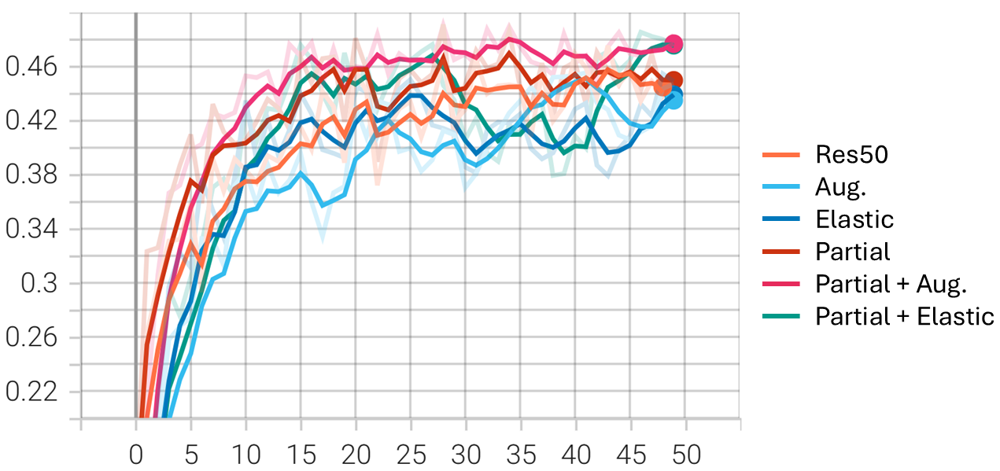
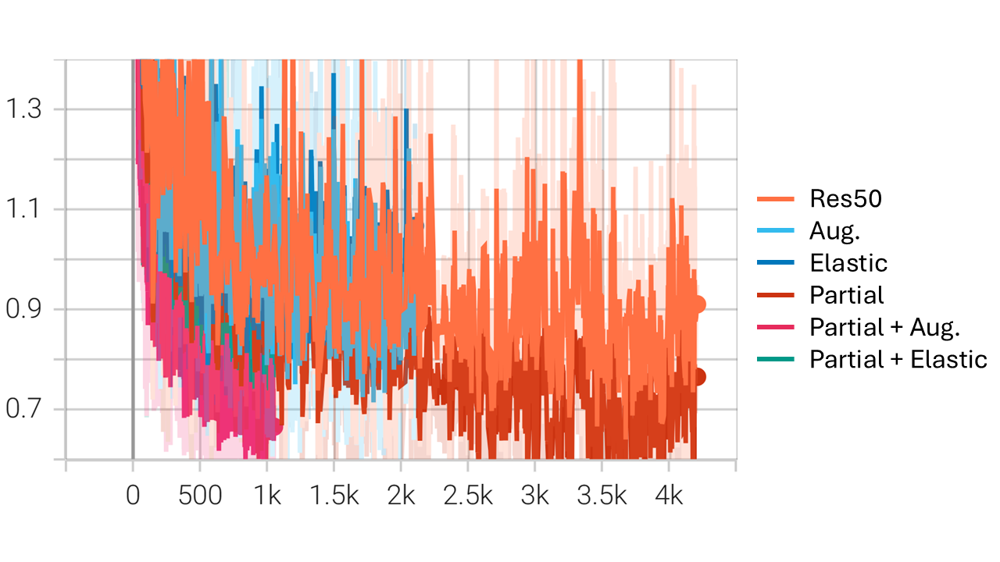

# NYCU DLVR HW3: Instance Segmentation

>[!NOTE]
> Author: 何義翔 (Yi-Hsiang, Ho)  
> StudentID: 111550106

## Introduction

This task involves performing instance segmentation on RGB medical images using Faster R-CNN. The datasets are from this course, including 209 images with masks for training/validation and 101 for testing. The core idea of this work is to freeze part of the network architecture as well as apply multiple data augmentations, e.g., color jitter, random transformation, and non-linear distortion.

## Requirement

- Python 3.12
- PyTorch 2.6.0 with CUDA 12.4
- TensorBoard
- tqdm
- pandas
- matplotlib
- scikit-image
- albumentations

It is recommended to use virtual environment. You can use Conda, venv, etc. The following commands are for Conda.

```bash
conda create --name DLVR_HW1 python=3.12
conda activate DLVR_HW1
pip install torch torchvision torchaudio tensorboard tqdm pandas matplotlib scikit-image albumentations
```

## How to use

### Train

To train the model with default settings (in NVIDIA GeForce RTX 4090, it needs about 8.5 hours to train):

```bash
python main.py --train
```

To test the model with best checkpoint:

```bash
python main.py --test
```

You can also specify `--device` to set the GPU ID. For more information about all arguments, please use `--help`.

If you want to adjust some settings, e.g., dataset path, number of epoches, learning rate, you could edit `CONFIG` variable in `main.py`.

## Performance

**The AP50 results of different methods.** “Val” refers to validation AP50. “Test pub.” and “Test priv.” refer to public and private test set AP50, respectively.

| Method            | Val AP50 | Test pub. AP50 | Test priv. AP50 |
| ----------------- | :------: | :------------: | :-------------: |
| Res50             | 0.4699   | 0.3640         | 0.3108          |
| Aug.              | 0.4555   | 0.3532         | 0.3663          |
| Elastic           | 0.4392   | 0.3383         | 0.3671          |
| Partial           | 0.4912   | 0.3271         | 0.3608          |
| Partial + Aug.    | 0.4906   | 0.3606         | 0.3827          |
| Partial + Elastic | 0.4855   | 0.3391         | 0.3853          |

**Validation AP50 curve.**



**Training loss curve.**



For more detail and experiment, please see the [report](/report/report.pdf).

## Repository Structure

```
├── dataset.py                        # Dataset loading and preprocessing
├── main.py                           # Main script & model class
├── utils.py                          # Utility functions
├── exp_src/                          # Experimental implementations
│   ├── utils.py
│   ├── main_res50.py                 # The original implementation of Mask R-CNN but freezing the backbone while fine-tuning
│   ├── main_aug.py                   # Add data augmentation
│   ├── main_partial.py               # Using partial fine-tuning
│   ├── main_restart.py               # Apply restart strategy on scheduler
│   └── ...
├── data/                             # Please place your dataset here
│   ├── test_release/                 # Testing set
│   ├── train/                        # Training set
│   │   ├── [image_name]
│   │   │   ├── class1.tif
│   │   │   ├── class3.tif
│   │   │   ├── class4.tif
│   │   │   └── image.tif
│   │   └── ...
│   ├── test_image_name_to_ids.json
│   └── valid.json                    # Ground truth bounding boxes and labels for valid dataset, in COCO format
└── report/                           # Project report
```

## License
This project is under MIT license, please see [LICENSE](LICENSE) for more detail.
